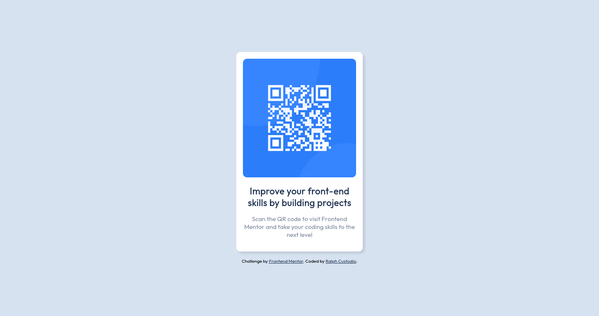

# Frontend Mentor - QR code component solution

This is a solution to the [QR code component challenge on Frontend Mentor](https://www.frontendmentor.io/challenges/qr-code-component-iux_sIO_H). Frontend Mentor challenges help you improve your coding skills by building realistic projects.

## Table of contents

- [Overview](#overview)
  - [Screenshot](#screenshot)
  - [Links](#links)
- [My process](#my-process)
  - [Built with](#built-with)
  - [What I learned](#what-i-learned)
  - [Useful resources](#useful-resources)
- [Author](#author)
- [Acknowledgments](#acknowledgments)

**Note: Delete this note and update the table of contents based on what sections you keep.**

## Overview

### Screenshot

### Links

- Solution URL: [Github Repository](https://github.com/itsmeralph09/Frontend-Mentor-QR-code-component-solution)
- Live Site URL: [Github Page](https://itsmeralph09.github.io/Frontend-Mentor-QR-code-component-solution/)

## My process

### Built with

- Semantic HTML5 markup
- CSS custom properties
- [Styled Components](https://styled-components.com/) - For styles
- Github Pages - Deployed via Github Action

### What I learned

- In this simple project, I learned about creating and using CSS custom properties. I also learned how to use these custom properties using the _var()_ function in CSS.

### Useful resources

- [Creating Color Themes With Custom Properties, HSL, and a Little calc()](https://css-tricks.com/creating-color-themes-with-custom-properties-hsl-and-a-little-calc/) - This helped me in creating CSS custom properties and how to use it.

## Author

- Frontend Mentor - [@itsmeralph09](https://www.frontendmentor.io/profile/itsmeralph09)
- Twitter - [@itsmeralph09](https://www.twitter.com/itsmeralph09)

## Acknowledgments

- Thanks to the community for helping out fix some minor corrections in the design.
